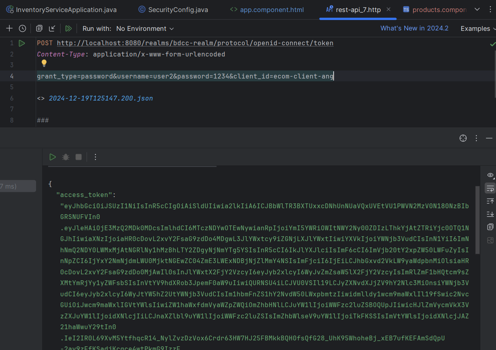
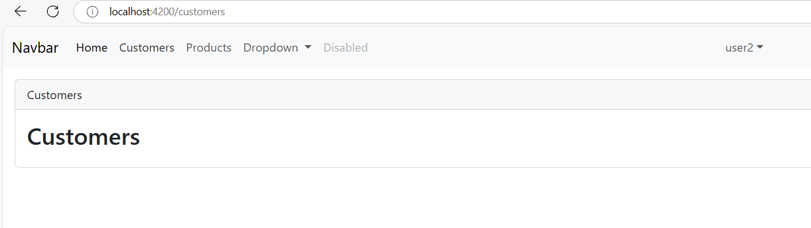
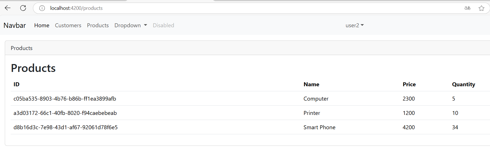
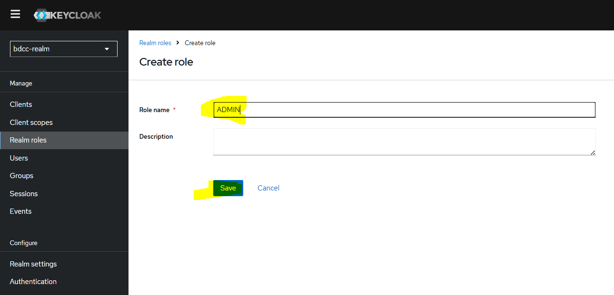
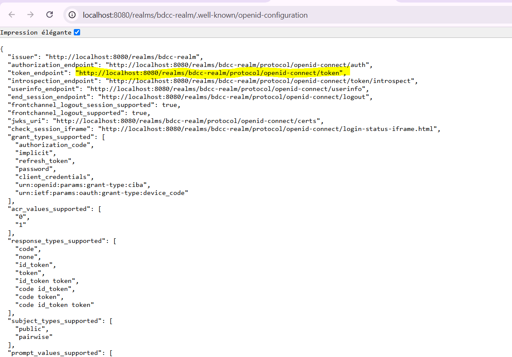

<h3>Compte Rendu</h3>

<h2>crèer un Realm</h2>

<h2>crèer un Role</h2>

<h2>crèer des users</h2>

<h2>crèer des mots de passe</h2>

<h2>utiliser Postman</h2>

<h2>JWT</h2>

<h2>Authentification avec password username</h2>

<h2>Authentification avec refresh Token</h2>

<h2>Authentification avec client_credential</h2>

